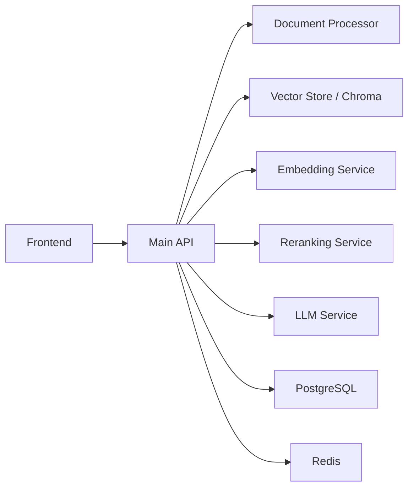

# Drass 系统架构说明

> 状态：已校正为当前项目概览。旧版把某一台 Ubuntu 机器上的脚本执行结果写成了系统统一架构，这并不准确。

## 项目定位

Drass 当前应被理解为一个多服务的数据合规分析与 RAG 辅助系统，而不是单一脚本、单一部署模式或 Dify 平台封装。

系统核心通常包含：

1. 前端应用
2. 主后端 API
3. 文档处理链路
4. 向量检索与知识库
5. Embedding / Reranking / LLM 等 AI 能力
6. 部署与生产化辅助脚本

## 当前高层架构

## 运行模式说明

当前仓库里至少存在三种常见运行模式：

### 1. 本地开发联调

- 常见入口：`./start-system.sh`
- 常见端口：前端 `5173`，主 API 常见为 `8000`
- 特点：开发态，多服务混合启动

### 2. 本机服务化运行

- 参考入口：`deployment/scripts/start-ubuntu-services.sh`
- 该路径下 API 常见为 `8888`
- 特点：带有宿主机路径、日志目录和端口约束

### 3. 容器化生产风格部署

- 参考入口：`deployment/production/docker-compose.prod.yml`
- 特点：更偏生产化资源组织，而不是单脚本开发启动

## 端口理解原则

旧文档最大的问题之一，是把单一路径中的端口写成全项目统一事实。当前更准确的理解应是：

| 组件 | 常见端口 | 说明 |
| --- | --- | --- |
| Frontend | `5173` | 开发态常见 |
| Main API | `8000` 或 `8888` | 取决于启动路径 |
| LLM Service | `8001` 或 `1234` | 取决于 provider / 本地模型方案 |
| Embedding Service | `8002` 或 `8010` | 取决于服务实现与部署模式 |
| Reranking Service | `8002`、`8004` 或 `8012` | 历史实现与部署路径并存 |
| ChromaDB | `8005` | 常见向量存储端口 |
| PostgreSQL | `5432` | 关系数据库 |
| Redis | `6379` | 缓存 / 限流 / 队列辅助 |

## 当前更应参考的文件

如果要了解真实项目，而不是历史快照，优先参考：

1. `README.md`
2. `docs/chensha_运行依赖分析.md`
3. `docs/ONE_CLICK_STARTUP_GUIDE.md`
4. `docs/chensha_部署与基础设施规则.md`
5. 具体启动脚本与服务配置文件

## 本文件不再承诺的内容

以下说法不再保留：

1. `/home/qwkj/drass` 是项目默认标准目录。
2. `start-ubuntu-services.sh` 代表全项目唯一权威架构。
3. 固定模型名、固定 GPU 占用率、固定数据库账号是仓库级通用事实。
4. 单次部署现场的日志路径和服务编排可以直接外推到所有环境。

## 结论

Drass 的正确主线不是“某一份历史部署现场快照”，而是“多服务系统 + 多部署路径 + 代码与脚本并存”。任何架构说明都应以当前仓库可验证的入口、配置和代码为准。
