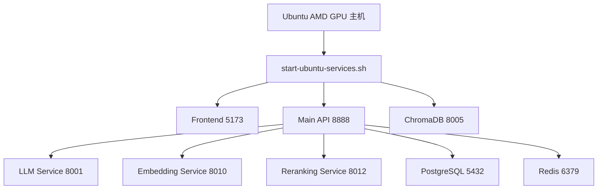

# Ubuntu AMD GPU 部署说明

> 状态：环境专用部署说明。可作为 `deployment/scripts/start-ubuntu-services.sh` 的配套阅读文件，但不应被理解为“对所有 Ubuntu 机器都直接适用的标准部署手册”。

## 文档范围

这份说明只描述当前仓库里可以确认的 Ubuntu AMD GPU 部署线索：

1. 仓库存在 `deployment/scripts/start-ubuntu-services.sh`。
2. 这套脚本明显面向一台已经准备过的宿主机环境。
3. 文档应说明脚本的真实假设和限制，而不是继续把某一台机器上的部署结果写成通用事实。

## 当前可确认的部署特征

### 1. 部署形态

这条路径不是完整容器化部署，而是“宿主机进程 + 本地依赖 + 外部模型服务”的混合方式。

### 2. 脚本内已写死的环境假设

当前脚本里可以直接看到以下假设：

1. 基础目录写死为 `/home/qwkj/drass`
2. API 端口按 `8888` 处理
3. 前端端口按 `5173` 处理
4. ChromaDB 端口按 `8005` 处理
5. 默认依赖外部或先行存在的 AI 服务端口：
   - `8001`：LLM
   - `8010`：Embedding
   - `8012`：Reranking

这意味着它更像“某一类目标机器的运维脚本”，而不是一份无需改动即可复用到任意环境的标准部署器。

### 3. 风险点

当前脚本存在几个需要注意的现实风险：

1. 它包含明显的宿主机硬编码路径。
2. 它把若干端口与运行方式当作既定前提。
3. 它内部还带有生成最小 API 文件的逻辑，说明这条部署路径并不完全是干净的标准化发布流程。

因此，这份文档不能再继续宣称“只要照步骤执行就得到统一生产环境”。

## 更准确的使用方式

### 部署前检查

执行这条部署路径前，应先核对以下条件：

1. 仓库部署目录是否与脚本中的基础目录一致。
2. 宿主机是否已经准备好 Python、Node.js、PostgreSQL、Redis。
3. 外部模型服务是否已经存在并与端口约定一致。
4. 是否接受 API 运行在 `8888` 而不是其它历史端口。
5. 是否接受脚本对日志目录、数据目录和局部启动文件的处理方式。

### 推荐阅读顺序

1. `README.md`
2. `docs/ONE_CLICK_STARTUP_GUIDE.md`
3. `docs/chensha_运行依赖分析.md`
4. `docs/chensha_部署与基础设施规则.md`
5. `deployment/scripts/start-ubuntu-services.sh`

### 推荐执行原则

1. 先把 `.env`、数据库、Redis、模型服务准备好。
2. 再逐项核对脚本里的路径、端口、日志目录。
3. 只有在确认目标机器与脚本假设一致时，才直接运行该脚本。
4. 若目标环境不一致，应复制脚本并按本机环境改造，而不是把文档中的历史路径继续当成标准值。

## 当前不再保留的错误表述

以下内容不再适合作为本文件的主叙事：

1. 把某个固定模型名称、GPU 占用比例写成通用部署事实。
2. 把 `/home/qwkj/drass` 当成项目默认标准路径。
3. 把单台机器上的数据库名、用户、密码写成仓库级默认配置。
4. 把特定环境下的健康检查命令和日志文件路径写成所有环境都成立的事实。

## 当前结论

这份 Ubuntu AMD GPU 文档现在只应承担一个职责：解释仓库内这条部署脚本的真实约束。它不是主项目的统一部署规范，真正的项目级部署规则应以 `docs/chensha_部署与基础设施规则.md` 为准，以脚本和配置文件为最终核对对象。
