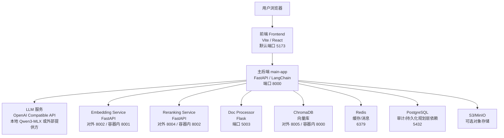
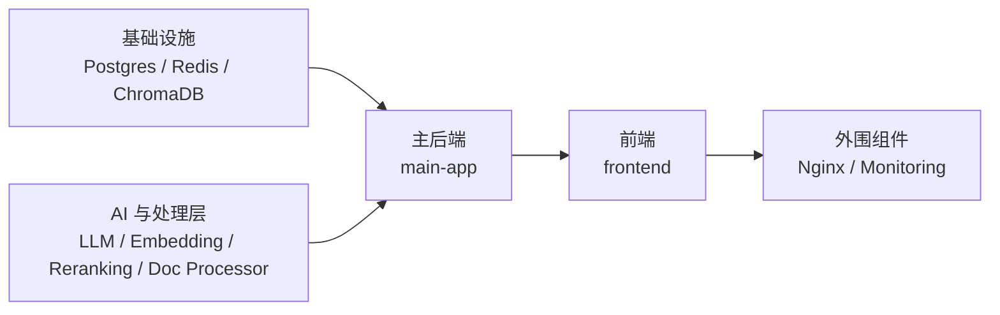

# Drass 项目运行依赖分析

- 生成日期：2026-04-26
- 分析对象：`/Users/csha/spec_coding/drass`
- 分析目标：识别项目在当前仓库状态下的真实运行依赖、启动链路、环境变量、外部服务和配置偏差

## 目录

1. [分析结论](#分析结论)
2. [分析依据](#分析依据)
3. [运行架构总览](#运行架构总览)
4. [运行依赖分层](#运行依赖分层)
5. [服务级依赖矩阵](#服务级依赖矩阵)
6. [启动顺序与依赖链路](#启动顺序与依赖链路)
7. [关键环境变量](#关键环境变量)
8. [当前仓库中的依赖声明与配置偏差](#当前仓库中的依赖声明与配置偏差)
9. [建议的最小可运行组合](#建议的最小可运行组合)
10. [结论](#结论)

## 分析结论

当前仓库里的 `drass` 已经不是 README 顶部描述的“Dify 配置工程”，而是一个多服务的合规/RAG 系统，主链路如下：

`Frontend -> Main API -> LLM / Embedding / Vector Store / Document Processor / Reranking`

从代码、Compose、Dockerfile 和启动脚本综合判断：

1. 这是一个典型的多运行时项目，至少涉及 `Node.js`、`Python 3.11`、`Docker/Compose`、`PostgreSQL`、`Redis`、`ChromaDB` 和一个 OpenAI 兼容的 LLM 接口。
2. 如果按“默认完整能力”运行，`main-app`、`frontend`、`LLM 服务`、`ChromaDB`、`文档处理能力` 是主链路核心依赖。
3. 当前仓库存在多处配置漂移，已经超过“文档不同步”范围，属于会直接影响启动或联调的运行依赖问题。
4. 最关键的偏差包括：
   - `docker-compose.yml` 引用了不存在的 `frontend/Dockerfile`
   - 前端默认请求 `8888`，后端主配置/脚本主要使用 `8000`
   - `main-app` 默认把文档处理服务指向 `8004`，但 `doc-processor` 实际运行在 `5003`
   - `main-app` 代码导入了 `sqlalchemy`、`aiofiles`，但依赖文件没有声明
   - `qwen3_api_server.py` 依赖 `mlx_lm`，根依赖文件未声明
   - `main-app` 与 `embedding-service` 的接口协议不一致

## 分析依据

本分析主要基于以下文件，不以旧文档描述为准，而以当前可执行配置和代码入口为准：

- `docker-compose.yml`
- `start-system.sh`
- `services/main-app/Dockerfile`
- `services/main-app/requirements.txt`
- `services/main-app/app/main.py`
- `services/main-app/app/core/config.py`
- `services/main-app/app/services/document_service.py`
- `services/main-app/app/services/vector_store.py`
- `services/main-app/app/services/embedding_service.py`
- `services/doc-processor/Dockerfile`
- `services/doc-processor/requirements.txt`
- `services/embedding-service/Dockerfile`
- `services/embedding-service/requirements.txt`
- `services/reranking-service/Dockerfile`
- `services/reranking-service/requirements.txt`
- `services/llm-gateway/Dockerfile`
- `services/llm-gateway/requirements.txt`
- `frontend/package.json`
- `frontend/vite.config.ts`
- `frontend/src/config/config.ts`
- `frontend/.env.local`
- `qwen3_api_server.py`

## 运行架构总览

### 依赖关系说明

- `frontend` 是用户入口，但它本身只负责 UI，核心业务依赖 `main-app`
- `main-app` 是系统核心，负责 API、RAG、知识库、审计、上传、任务处理
- `LLM` 是生成能力依赖，缺失时聊天与分析主能力不可用
- `Embedding`、`Vector Store`、`Doc Processor` 共同支撑知识库/RAG
- `Reranking` 用于检索结果优化，可增强，也可部分降级
- `Redis`、`PostgreSQL`、`S3` 更偏基础设施/增强能力依赖，不同路径上硬度不同

## 运行依赖分层

### 1. 宿主机/基础运行环境

| 依赖 | 作用 | 是否默认需要 | 备注 |
| --- | --- | --- | --- |
| Docker / Docker Compose | 启动 `postgres`、`redis`、`chromadb`、`reranking-service`、`doc-processor` 等容器 | 高 | `start-system.sh` 明确依赖 |
| Python 3.11 | `main-app`、`embedding-service`、`doc-processor`、`reranking-service`、`llm-gateway` 主要运行时 | 高 | 多个 Dockerfile 基于 `python:3.11-slim` |
| Node.js + npm | `frontend` 开发运行与构建 | 高 | `frontend/package.json` 使用 Vite |
| curl | 健康检查 | 中 | 多个 Dockerfile 和脚本使用 |
| lsof | 启动脚本清理端口 | 中 | `start-system.sh` 使用 |
| Git / Shell 环境 | 辅助部署和脚本执行 | 低 | 非业务硬依赖 |

### 2. 系统级库/命令依赖

这些依赖不是 Python 包，而是运行时系统库或 CLI 工具：

| 依赖 | 使用位置 | 作用 |
| --- | --- | --- |
| `tesseract-ocr` | `main-app`、`doc-processor` Dockerfile | OCR 文本提取 |
| `tesseract-ocr-eng` | `main-app`、`doc-processor` | 英文 OCR 语言包 |
| `tesseract-ocr-chi-sim` | `main-app` Dockerfile、`doc-processor` 简化镜像 | 中文 OCR 语言包 |
| `poppler-utils` | `main-app`、`doc-processor` | `pdftotext`、`pdftoppm` 处理 PDF |
| `libmagic1` | `doc-processor` | `python-magic` 文件类型识别 |
| `gcc` / `g++` / `build-essential` | 多个 Python 服务镜像 | 构建依赖包 |
| `pandoc` | `doc-processor` 可选路径 | 通用文档转换，当前代码仅在启用且安装时生效 |

### 3. 容器级基础设施依赖

| 服务 | 端口 | 角色 | 依赖硬度 |
| --- | --- | --- | --- |
| PostgreSQL 15 | `5432` | 审计、模型、迁移规划层数据库 | 中到高 |
| Redis 7 | `6379` | 缓存、消息、部分服务状态 | 中 |
| ChromaDB | `8005 -> 8000` | 向量库 | 高 |
| Nginx | `80/443` | 生产代理 | 可选 |
| Prometheus | `9090` | 监控 | 可选 |
| Grafana | `3001 -> 3000` | 指标看板 | 可选 |

### 4. AI 与外部能力依赖

| 依赖 | 作用 | 当前仓库中体现方式 |
| --- | --- | --- |
| OpenAI 兼容 LLM API | 对话、生成、分析 | `main-app` 通过 `LLM_BASE_URL` 访问 |
| 本地 MLX 模型 | Apple Silicon 本地推理 | `qwen3_api_server.py` + `mlx_lm` + `mlx_qwen3_converted` |
| HuggingFace / Sentence Transformers | 本地向量与重排模型 | `embedding-service`、`reranking-service`、`vector_store.py` |
| S3 / MinIO | 可选对象存储 | `storage_service.py` |
| OpenRouter / OpenAI / Cohere | 替代模型或嵌入提供方 | 多处 `requirements.txt` 与 `.env.example` |

## 服务级依赖矩阵

### 核心服务

| 服务 | 启动方式 | 主要运行时 | 直接依赖 | 依赖性质 | 说明 |
| --- | --- | --- | --- | --- | --- |
| `frontend` | 本地 `npm` / Compose 计划 | Node.js、Vite、React | `main-app` HTTP/WS | 硬依赖 | 当前默认配置更偏向访问 `8888` |
| `main-app` | 本地 `uvicorn` / Docker | Python 3.11、FastAPI、LangChain | LLM、Chroma、文档处理、嵌入、Redis、Postgres、存储 | 核心中枢 | 多条能力链都汇聚在此 |
| `qwen3_api_server.py` | 本地 Python | Flask、`mlx_lm` | 本地模型目录 | 主链路硬依赖之一 | 默认对外 `8001` |
| `embedding-service` | Docker / 本地 Python | FastAPI、sentence-transformers、torch | 模型缓存、可选 Redis | 高 | 当前接口协议与 `main-app` 不一致 |
| `doc-processor` | Docker / 本地 Python | Flask、OCR、PDF/Office 处理库 | `tesseract`、`poppler`、`libmagic` | 中到高 | 代码提供降级路径 |
| `reranking-service` | Docker | FastAPI、sentence-transformers、torch | 模型缓存、可选 Redis | 中 | 检索增强服务 |
| `chromadb` | Docker | ChromaDB | 本地卷 | 高 | `main-app` 可本地持久化回退，但默认链路仍依赖它 |

### 辅助服务

| 服务 | 作用 | 是否在默认主链路上 | 备注 |
| --- | --- | --- | --- |
| `postgres` | 审计/结构化数据 | 部分功能在主链路上 | 代码已引入 SQLAlchemy 模型和迁移逻辑 |
| `redis` | 缓存、消息 | 部分功能在主链路上 | 某些路径可退化为内存 |
| `llm-gateway` | 多模型网关 | 否 | Compose 中可选 |
| `scheduler` | 定时任务 | 否 | 当前不在主 Compose 主链路中 |
| `nginx` | 生产反向代理 | 否 | `profiles: production` |
| `prometheus` / `grafana` | 监控 | 否 | `profiles: monitoring` |

## 启动顺序与依赖链路

### 推荐启动顺序

1. 基础设施：`postgres`、`redis`、`chromadb`
2. AI 与处理服务：`LLM`、`embedding-service`、`reranking-service`、`doc-processor`
3. 核心后端：`main-app`
4. 前端：`frontend`
5. 可选外围：`nginx`、`prometheus`、`grafana`

### 启动依赖图

### 主后端内部依赖链

`main-app` 在启动 `lifespan` 中会初始化：

1. `vector_store_service`
2. `unified_llm_service`
3. `embedding_service`
4. `document_service`
5. `document_processor`
6. `rag_optimization_service`
7. `message_broker`（仅 Redis 启用时）

这意味着 `main-app` 是最需要“前置依赖就绪”的节点。

## 关键环境变量

以下是对运行影响最大的环境变量：

| 变量名 | 作用 | 典型值 | 重要性 |
| --- | --- | --- | --- |
| `LLM_PROVIDER` | 选择 LLM 提供方 | `openai` / `vllm` / `mlx` / `openrouter` | 高 |
| `LLM_BASE_URL` | `main-app` 实际读取的 LLM 地址 | `http://localhost:8001/v1` | 高 |
| `LLM_MODEL` | 主模型名 | `qwen3-8b-mlx` | 高 |
| `LLM_API_KEY` | OpenAI 兼容接口 key | 本地时常为占位值 | 中 |
| `EMBEDDING_API_BASE` | 嵌入服务地址 | `http://localhost:8002` 或容器内 `http://embedding-service:8001` | 高 |
| `EMBEDDING_MODEL` | 嵌入模型名 | `BAAI/bge-base-en-v1.5` 等 | 高 |
| `RERANKING_ENABLED` | 是否启用重排 | `true` / `false` | 中 |
| `RERANKING_API_BASE` | 重排服务地址 | `http://localhost:8004` | 中 |
| `VECTOR_STORE_TYPE` | 向量存储类型 | `chromadb` | 高 |
| `CHROMA_SERVER_HOST` | Chroma 服务地址 | `localhost` / `chromadb` | 高 |
| `CHROMA_SERVER_PORT` | Chroma 端口 | `8005` 或容器内 `8000` | 高 |
| `DATABASE_URL` | PostgreSQL 连接串 | `postgresql://...` | 中到高 |
| `REDIS_URL` | Redis 连接串 | `redis://localhost:6379` | 中 |
| `STORAGE_TYPE` | 文件存储类型 | `local` / `s3` / `minio` | 中 |
| `STORAGE_PATH` | 本地文件存储目录 | `./data/uploads` | 高 |
| `DOC_PROCESSOR_URL` | 文档处理服务地址 | 应为 `http://localhost:5003` | 高 |
| `SECRET_KEY` | 安全签名 | 自定义密钥 | 高 |

## 当前仓库中的依赖声明与配置偏差

这一节是本分析最重要的结果，以下问题都会直接影响运行。

### 1. `frontend` 容器构建文件缺失

- 现象：`docker-compose.yml` 中 `frontend.build.dockerfile` 指向 `./frontend/Dockerfile`
- 实际：仓库中不存在 `frontend/Dockerfile`
- 影响：`docker compose up frontend` 无法按当前配置直接构建前端镜像
- 判断：这是明确的运行依赖缺口

### 2. 前端默认后端地址与后端实际端口不一致

- 前端多个位置默认使用 `http://localhost:8888`
- `main-app` 默认和启动脚本主要使用 `8000`
- 影响：即使后端正常运行，前端也可能请求到错误端口
- 涉及位置：
  - `frontend/.env.local`
  - `frontend/vite.config.ts`
  - `frontend/src/config/config.ts`
  - 多个 `frontend/src` 组件和 `frontend/public` 测试页面

### 3. 文档处理服务地址配置错误

- `doc-processor` 实际端口是 `5003`
- `services/main-app/app/services/document_service.py` 默认 `DOC_PROCESSOR_URL` 却是 `http://localhost:8004`
- `8004` 在当前系统中对应的是 `reranking-service`
- 影响：`main-app` 默认会把文档转换请求打到错误服务
- 结果：文档上传后大概率只能走回退逻辑，无法稳定使用专用转换服务

### 4. `main-app` 存在代码导入但未声明的 Python 依赖

- 代码中实际使用：
  - `sqlalchemy`
  - `asyncpg`
  - `alembic` 相关迁移能力
  - `aiofiles`
- 但 `services/main-app/requirements.txt` 中：
  - `sqlalchemy`、`asyncpg`、`alembic` 被注释掉
  - `aiofiles` 未声明
- 影响：
  - 启动导入链可能直接失败
  - 审计、迁移、文件存储等功能运行不完整
- 判断：这是高优先级运行依赖声明缺口

### 5. 本地 MLX LLM 依赖未完整声明

- `qwen3_api_server.py` 直接导入：
  - `flask`
  - `mlx_lm`
- 根目录 `requirements.txt` 中有 `Flask`，但没有 `mlx_lm`
- 同时还依赖本地模型目录：`mlx_qwen3_converted`
- 影响：本地 LLM 服务无法仅凭根依赖文件完成安装与运行

### 6. `main-app` 与 `embedding-service` 接口协议不一致

- `main-app` 当前发送：
  - `POST /embeddings`
  - 请求体为 `{"input": [...], "model": "..."}`
  - 期待返回结构中的 `data[].embedding`
- `services/embedding-service/app.py` 当前定义：
  - 请求体字段为 `texts`
  - 返回结构为 `{"embeddings": [...], "model": "...", "usage": ...}`
- 影响：如果 `main-app` 直接接当前仓库的 `embedding-service`，嵌入链路会失败
- 判断：这是接口契约级偏差，不是简单环境变量问题

### 7. Compose 中 LLM 地址变量与代码读取变量不一致

- `docker-compose.yml` 为 `main-app` 设置的是 `OPENAI_API_BASE`
- `main-app` 代码核心读取的是 `LLM_BASE_URL`
- `services/main-app/app/core/config.py` 中 `LLM_BASE_URL` 默认值为 `http://localhost:1234/v1`
- 影响：容器化启动时，`main-app` 可能不会读取到 Compose 提供的 LLM 地址，而继续使用默认值
- 结果：即使宿主机 `8001` 的本地 LLM 正常运行，`main-app` 仍可能连到错误地址

### 8. `PostgreSQL` 是代码级依赖，但当前主链路实现并未完全一致

- Compose 中 `main-app` 明确依赖 `postgres`
- 代码中已有 SQLAlchemy 模型、迁移、审计增强服务
- 但文档管理主逻辑又仍然大量使用内存字典和本地 JSON 持久化
- 影响：数据库依赖处于“部分接入”状态
- 判断：它不是完全可删的依赖，但也不是所有功能都真正基于数据库运行

### 9. ChromaDB 具备本地回退，但默认部署仍以服务化为主

- `vector_store.py` 会优先尝试连接 Chroma 服务端
- 失败后才回退到本地 `persist_directory`
- 影响：在开发环境中可以降级运行，但在默认部署方案里 Chroma 仍然是主依赖

## 建议的最小可运行组合

### 方案 A：当前仓库的“最小可运行开发组合”

适合先把主链路跑通：

1. 宿主机启动本地 LLM：`qwen3_api_server.py`
2. 启动 `chromadb`
3. 修正 `LLM_BASE_URL`、前端端口配置、`DOC_PROCESSOR_URL`
4. 为 `main-app` 补齐缺失依赖后启动 `main-app`
5. 本地运行 `frontend`

这套组合下可以先不启用：

- `nginx`
- `prometheus`
- `grafana`
- `scheduler`
- `llm-gateway`

注意：

1. 不要把 `deployment/scripts/` 下的所有辅助脚本都当作当前标准启动入口。
2. 其中一部分脚本仍然明显偏向单机 Ubuntu 运维现场，存在固定目录、固定用户或固定模型目录假设。
3. 当前更可信的入口，仍然是 `start-system.sh`、`start-api-noproxy.sh`、`start-frontend-only.sh`、`deployment/scripts/start-ubuntu-services.sh`。

### 方案 B：较完整的功能组合

除方案 A 外，再加入：

1. `redis`
2. `postgres`
3. `embedding-service`
4. `reranking-service`
5. `doc-processor`

前提是需要先修复本文件列出的协议与配置偏差。

## 结论

从 2026-04-26 当前仓库状态来看，`drass` 的运行依赖已经形成一个多服务系统，但依赖声明、端口配置、服务契约和 Compose 编排之间存在明显漂移。

如果只问“这个项目运行需要什么”，答案不是单一 `requirements.txt`，而是下面这组组合：

- 宿主机：`Python 3.11`、`Node.js`、`npm`、`Docker/Compose`
- 基础设施：`ChromaDB`，通常还包括 `Redis`、`PostgreSQL`
- AI 能力：一个 OpenAI 兼容的 LLM 接口，或本地 `MLX + qwen3`
- 文档处理：`tesseract`、`poppler`、`libmagic` 等系统库
- 应用层：`frontend`、`main-app`、`embedding-service`、`reranking-service`、`doc-processor`

另外还应注意一件事：

- 仓库里仍保留多份环境专用修复脚本和部署辅助脚本，它们可以当排障参考，但不能直接等同于当前项目标准运行规范。

但在真正执行启动前，必须优先处理本文件“当前仓库中的依赖声明与配置偏差”一节中的问题，否则会出现：

- 服务无法构建
- 服务启动后互相连错地址
- 依赖已安装但接口不兼容
- 文档处理和嵌入链路不能按设计工作

换句话说，这个项目的核心问题不是“缺一两个包”，而是“运行依赖已经具备多服务复杂度，但配置与声明还没有完成收敛”。
