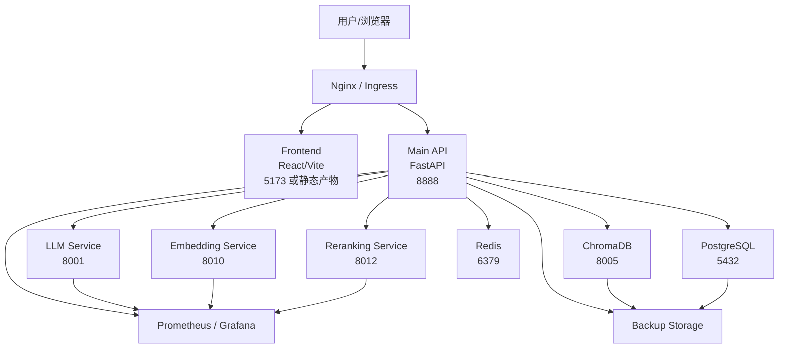
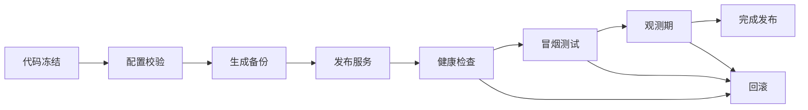

# Drass 部署与基础设施规则

- 生成日期：2026-04-26
- 适用范围：`/Users/csha/spec_coding/drass`
- 文档目标：定义本项目在开发、测试、预发、生产环境中的部署基线、基础设施边界、配置规则、运行约束与变更规范

## 目录

1. [文档定位](#文档定位)
2. [部署模式总则](#部署模式总则)
3. [标准基础设施拓扑](#标准基础设施拓扑)
4. [环境分层规则](#环境分层规则)
5. [组件职责与运行边界](#组件职责与运行边界)
6. [主机与资源规则](#主机与资源规则)
7. [网络与端口规则](#网络与端口规则)
8. [配置与环境变量规则](#配置与环境变量规则)
9. [密钥与证书规则](#密钥与证书规则)
10. [存储与数据规则](#存储与数据规则)
11. [进程托管与服务管理规则](#进程托管与服务管理规则)
12. [反向代理与入口流量规则](#反向代理与入口流量规则)
13. [监控、日志与告警规则](#监控日志与告警规则)
14. [备份、恢复与容灾规则](#备份恢复与容灾规则)
15. [部署发布规则](#部署发布规则)
16. [回滚规则](#回滚规则)
17. [安全基线规则](#安全基线规则)
18. [当前仓库必须优先收敛的基础设施偏差](#当前仓库必须优先收敛的基础设施偏差)
19. [上线验收清单](#上线验收清单)
20. [结论](#结论)

## 文档定位

本文不是单纯的“安装步骤”，而是本项目的部署与基础设施治理规则。目标有三点：

1. 明确项目允许的部署模式和推荐生产基线。
2. 约束端口、目录、进程、密钥、存储、监控、备份和发布行为。
3. 把当前仓库中已经出现的配置漂移纳入治理范围，避免后续继续分叉。

本文以当前仓库现有文件为依据，重点参考：

- `docker-compose.yml`
- `deployment/production/docker-compose.prod.yml`
- `deployment/docs/ubuntu-amd-deployment.md`
- `deployment/configs/presets/ubuntu-amd-production.yaml`
- `production/.env.production`
- `production/drass-main-app.service`
- `production/drass-frontend.service`
- `production/configs/nginx/nginx.production.conf`
- `production/configs/monitoring/prometheus.yml`
- `production/health-check.sh`
- `production/backup-production.sh`
- `production/backup-recovery-strategy.sh`
- `deployment/scripts/start-ubuntu-services.sh`
- `deployment/scripts/stop-ubuntu-services.sh`

## 部署模式总则

### 允许的部署模式

本项目当前允许三种部署模式：

1. `本地开发模式`
   - 目标：开发、调试、接口联调
   - 典型形态：前端本地运行，后端本地运行，基础设施部分容器化
   - 主要依据：根目录 `docker-compose.yml`、`start-system.sh`

2. `容器化生产模式`
   - 目标：以容器方式集中编排后端、AI 服务、缓存、代理、监控
   - 主要依据：`deployment/production/docker-compose.prod.yml`

3. `本机服务化生产模式`
   - 目标：在 Ubuntu AMD GPU 主机上使用 systemd + 本地/独立 AI 服务运行
   - 主要依据：`deployment/docs/ubuntu-amd-deployment.md`、`deployment/scripts/start-ubuntu-services.sh`、`production/*.service`

### 推荐生产基线

生产环境推荐优先采用：

- `AI 推理服务独立化`
- `应用层服务化托管`
- `基础设施持久化`
- `Nginx 统一入口`
- `Prometheus + Grafana 监控`
- `自动备份 + 恢复演练`

这意味着生产推荐基线应是：

1. LLM / Embedding / Reranking 独立服务运行。
2. `main-app` 与 `frontend` 由 systemd 或容器编排稳定托管。
3. Nginx 作为统一外部入口。
4. 数据、向量、日志、备份目录全部独立持久化。

### 不允许的混合方式

以下做法属于禁止项：

1. 同一环境内同时存在两套主端口约定但未明确隔离。
2. 生产环境使用临时脚本随手拉起关键服务而不接入 systemd 或容器编排。
3. 将密钥、生产密码、证书私钥直接写入 Git 仓库。
4. 未统一变量名就直接替换 AI 服务或后端端口。

## 标准基础设施拓扑



### 拓扑规则

1. 外部流量必须先经过 Nginx 或等价入口层。
2. `frontend` 和 `main-app` 不应直接裸露给公网，除非仅用于临时内网调试。
3. AI 服务、Redis、PostgreSQL、ChromaDB 默认只允许内网访问。
4. 监控面与业务面应逻辑隔离，Grafana 不应默认对公网开放。

## 环境分层规则

### 环境定义

| 环境 | 目标 | 可接受特性 | 禁止项 |
| --- | --- | --- | --- |
| `dev` | 本地开发 | 热更新、较低安全约束、本地 mock | 生产密钥、生产数据 |
| `test` | 集成测试 | 自动化测试、稳定依赖 | 人工随意改端口 |
| `staging` | 预发验证 | 接近生产、可回滚 | 开发直连数据库 |
| `prod` | 对外服务 | 高可用、可观测、可恢复 | 未备案变更、硬编码密钥 |

### 环境一致性规则

1. 每个环境都必须有独立 `.env` 或配置文件。
2. 不同环境的数据库、Redis、Chroma 数据目录必须隔离。
3. `dev` 可以用 SQLite 或本地持久化，`prod` 必须使用正式持久化策略。
4. `prod` 必须通过固定目录、固定服务名、固定端口和固定反向代理配置管理。

## 组件职责与运行边界

### 核心业务组件

| 组件 | 职责 | 运行边界 |
| --- | --- | --- |
| `frontend` | 用户界面、浏览器交互 | 不直接访问数据库或内部基础设施 |
| `main-app` | 核心 API、RAG、文档、审计、编排 | 是唯一业务中枢 |
| `llm-service` | 文本生成与推理 | 通过 HTTP/OpenAI 兼容接口提供服务 |
| `embedding-service` | 向量生成 | 不承担业务逻辑 |
| `reranking-service` | 检索重排 | 作为增强层，不承接核心业务状态 |
| `chromadb` | 向量存储 | 只用于检索索引与相似度查询 |
| `redis` | 缓存、消息、会话辅助 | 不承担唯一持久化责任 |
| `postgresql` | 结构化持久化 | 用于正式业务数据与审计 |

### 辅助组件

| 组件 | 职责 | 说明 |
| --- | --- | --- |
| `nginx` | 统一入口、转发、基础安全头 | 必须作为生产标准入口 |
| `prometheus` | 指标采集 | 采集业务和系统指标 |
| `grafana` | 仪表盘展示 | 仅内部访问 |
| `loki/promtail` | 日志采集 | 可选，但建议作为生产增强 |

### 边界约束

1. `frontend` 只能通过 HTTP/WS 访问 `main-app`。
2. `main-app` 是唯一允许直接访问 AI、缓存、向量库和数据库的业务组件。
3. 文档处理、向量生成和重排服务应视为可替换基础能力，不应绑定业务流程细节。
4. 任何新服务接入都必须先定义端口、健康检查、日志路径和数据归属。

## 主机与资源规则

### 生产主机基线

根据现有文档和脚本，生产至少应满足：

| 资源项 | 建议基线 |
| --- | --- |
| 操作系统 | Ubuntu 22.04 LTS |
| CPU | 8 vCPU 起 |
| 内存 | 32 GB 起 |
| 磁盘 | 200 GB SSD 起 |
| GPU | 2 张 AMD GPU 或等价推理资源 |
| Python | 3.11 优先 |
| Node.js | 18.x 优先 |

### 资源分配规则

1. LLM、Embedding、Reranking 不得与数据库争抢同一块高负载磁盘。
2. GPU 模型服务必须有显式显存配额或等效资源限制。
3. `main-app` 进程数必须结合 CPU 核数、I/O 模式和模型调用延迟进行配置。
4. 所有写放大目录必须放在可监控的持久化盘上。

### 容量规划规则

1. 上传目录增长必须单独监控。
2. Chroma 持久化目录必须纳入磁盘容量告警。
3. 备份目录必须与业务运行目录区分，避免同盘爆满拖垮服务。

## 网络与端口规则

### 标准端口基线

生产环境推荐使用以下端口基线：

| 组件 | 标准端口 | 说明 |
| --- | --- | --- |
| `frontend` | `5173` | 仅内部或代理后访问 |
| `main-app` | `8888` | 生产 API 标准端口 |
| `llm-service` | `8001` | OpenAI 兼容接口 |
| `embedding-service` | `8010` | 嵌入服务 |
| `reranking-service` | `8012` | 重排服务 |
| `chromadb` | `8005` | 向量库 |
| `redis` | `6379` | 缓存 |
| `postgresql` | `5432` | 数据库 |
| `prometheus` | `9090` | 指标 |
| `grafana` | `3000` 或 `3001` | 看板 |
| `nginx` | `80/443` | 外部入口 |

### 端口规则

1. `prod` 环境以 `8888` 作为 `main-app` 生产标准端口。
2. `dev` 环境允许使用 `8000`，但不得与 `prod` 配置混写。
3. 所有前端配置必须通过统一变量读取 API 地址，不允许在组件中散落硬编码端口。
4. AI 服务端口必须固定，不得在无通知情况下漂移。
5. 基础设施端口默认只允许本机或内网访问。

### 防火墙规则

1. 公网开放端口原则上仅 `80/443`。
2. `5432`、`6379`、`8001`、`8010`、`8012`、`8005` 不应裸露公网。
3. Grafana、Prometheus 如需远程访问，必须加认证与来源限制。

## 配置与环境变量规则

### 配置源规则

配置优先级必须统一为：

1. 环境变量
2. 环境专属 `.env`
3. 部署模板或预设文件
4. 代码默认值

### 生产环境必须统一的变量名

以下变量名应作为项目基线：

| 变量名 | 含义 |
| --- | --- |
| `LLM_PROVIDER` | LLM 提供方 |
| `LLM_BASE_URL` | 主 LLM 地址 |
| `LLM_API_KEY` | 主 LLM 密钥 |
| `LLM_MODEL` | 主模型名 |
| `EMBEDDING_API_BASE` | 嵌入服务地址 |
| `EMBEDDING_MODEL` | 嵌入模型名 |
| `EMBEDDING_API_KEY` | 嵌入密钥 |
| `RERANKING_API_BASE` | 重排服务地址 |
| `RERANKING_MODEL` | 重排模型名 |
| `RERANKING_API_KEY` | 重排密钥 |
| `DOC_PROCESSOR_URL` | 文档处理服务地址 |
| `DATABASE_URL` | 数据库连接串 |
| `REDIS_URL` | Redis 连接串 |
| `VECTOR_STORE_TYPE` | 向量库类型 |
| `CHROMA_SERVER_HOST` | Chroma 地址 |
| `CHROMA_SERVER_PORT` | Chroma 端口 |
| `SECRET_KEY` | 应用密钥 |
| `JWT_SECRET` 或统一 JWT 变量 | 认证密钥 |

### 配置规则

1. 同一能力只允许一个主变量名，不允许同时使用多个同义变量而不做映射。
2. 若兼容历史变量名，必须在启动入口中显式做映射。
3. `frontend` 只能读取 `VITE_*` 前缀变量，不得在源码中写死环境地址。
4. 生产 `.env` 文件必须放置于受控目录，不得提交到仓库。

## 密钥与证书规则

### 密钥管理规则

1. 所有生产密钥必须通过环境变量或 Secret 管理系统下发。
2. `SECRET_KEY`、JWT 密钥、数据库密码、Redis 密码、Grafana 管理密码不得提交到仓库。
3. 样例配置文件只允许保留占位值，不得保留真实值。
4. AI 服务的 API Key 即使是内网占位值，也应作为敏感配置处理。

### 证书规则

1. 本地测试可使用自签名证书。
2. 正式生产必须使用可信 CA 证书。
3. `nginx/ssl` 目录必须限制访问权限。
4. 证书续期必须纳入运维计划。

## 存储与数据规则

### 标准目录规则

生产建议采用以下目录布局：

```text
/home/qwkj/drass/
├── frontend/
├── services/
├── logs/
├── data/
│   ├── uploads/
│   ├── chromadb/
│   ├── redis/
│   ├── postgresql/
│   └── tmp/
├── production/
│   ├── configs/
│   ├── backups/
│   └── monitoring/
└── models/
```

### 数据分类规则

| 数据类型 | 目录建议 | 持久化要求 |
| --- | --- | --- |
| 用户上传文档 | `data/uploads` | 必须持久化 |
| 向量索引 | `data/chromadb` | 必须持久化 |
| Redis 数据 | `data/redis` | 建议持久化 |
| PostgreSQL 数据 | 独立数据目录或托管卷 | 必须持久化 |
| 日志 | `logs` | 建议滚动归档 |
| 备份 | `production/backups` | 必须独立保留 |
| 模型文件 | `models` | 必须版本可追踪 |

### 数据规则

1. 上传文件、向量库、数据库、日志不得混放在同一个无约束目录。
2. 临时文件目录必须可定期清理。
3. Chroma 数据目录与备份目录必须区分。
4. 恢复操作不得直接覆盖生产数据，必须先做快照或二次备份。

## 进程托管与服务管理规则

### 托管方式规则

生产环境关键服务必须满足下列之一：

1. 由 systemd 托管。
2. 由 Docker Compose 或等价编排托管。

### 必须托管的服务

- `main-app`
- `frontend`
- `nginx`
- `postgresql`
- `redis`
- `chromadb`
- `llm-service`
- `embedding-service`
- `reranking-service`

### 服务管理规则

1. 关键服务必须配置自动重启。
2. 关键服务必须配置健康检查。
3. 关键服务必须具备独立日志输出。
4. 禁止长期依赖 `nohup` 作为生产主托管方式。

### 进程约束

1. `main-app` 必须使用固定工作目录。
2. Python 虚拟环境路径必须在 unit 文件或启动脚本中显式声明。
3. 前端生产应优先使用静态构建产物，不推荐长期使用 `vite dev` 作为生产前端服务。
4. 任何自动生成的“简化版 API”脚本不得进入正式生产链路。

## 反向代理与入口流量规则

### Nginx 入口规则

1. `/` 指向前端。
2. `/api/` 指向 `main-app`。
3. `/health` 指向后端健康检查。
4. WebSocket 路由必须开启 `Upgrade` / `Connection` 头透传。

### 代理层安全规则

1. 必须设置基础安全头。
2. 必须限制上传体积。
3. 必须配置合理的超时时间。
4. 对监控入口必须限制访问。

### 静态资源规则

1. 生产环境优先使用构建后的静态文件。
2. 若使用 dev server 代理，仅允许在内网或预发布环境。

## 监控、日志与告警规则

### 监控覆盖范围

生产必须覆盖以下指标：

1. API 健康状态与响应时延
2. LLM / Embedding / Reranking 可用性
3. PostgreSQL、Redis、Chroma 可用性
4. CPU、内存、磁盘、GPU 使用率
5. 上传目录和向量目录容量
6. 错误率、超时率、5xx 比例

### 日志规则

1. 每个服务必须输出独立日志。
2. API 日志必须包含请求 ID、时间、级别和错误堆栈。
3. Nginx 访问日志必须保留响应时间字段。
4. 日志保留策略必须明确，避免无限增长。

### 告警规则

生产至少要有以下告警：

| 告警项 | 阈值建议 |
| --- | --- |
| API 不可用 | 连续 3 次失败 |
| AI 服务不可用 | 连续 3 次失败 |
| 5xx 错误率高 | 5 分钟窗口超过阈值 |
| 磁盘使用率高 | 超过 80% 告警，90% 严重 |
| 内存使用率高 | 超过 85% |
| GPU 显存过高 | 超过安全阈值 |
| 备份失败 | 当日未成功执行 |

## 备份、恢复与容灾规则

### 备份范围

必须备份以下内容：

1. PostgreSQL 数据
2. 上传文件目录
3. Chroma 持久化目录
4. 生产配置文件
5. 生产环境变量文件

### 备份频率规则

依据现有脚本，建议采用：

| 类型 | 频率 | 保留 |
| --- | --- | --- |
| 日备份 | 每天 02:00 | 30 天 |
| 周备份 | 每周日 03:00 | 12 周 |
| 月备份 | 每月 1 日 04:00 | 12 个月 |
| 清理任务 | 每天 05:00 | 清理过期备份 |

### 恢复规则

1. 恢复前必须停止业务写入。
2. 恢复前必须验证备份完整性。
3. 恢复必须按顺序进行：数据库、上传、向量库、配置、环境变量。
4. 恢复完成后必须执行健康检查和冒烟测试。
5. 至少每季度执行一次恢复演练。

### RPO / RTO 建议

- `RPO`：24 小时内
- `RTO`：4 小时内

若业务级别提升，应将数据库与上传目录改造成更高频备份方案。

## 部署发布规则

### 发布前置条件

每次发布前必须完成：

1. 配置校验
2. 依赖检查
3. 健康检查脚本预跑
4. 备份最新快照
5. 变更说明记录

### 发布流程规则

标准发布流程：



### 发布规则

1. 发布必须以脚本或编排执行，不允许人工逐条敲命令构成正式流程。
2. 发布必须包含健康检查。
3. 发布必须保留发布前后版本信息。
4. 发布失败时必须有确定的回滚入口。

## 回滚规则

### 允许回滚的对象

1. 应用代码版本
2. 前端静态构建版本
3. Nginx 配置
4. 环境变量文件
5. 数据目录快照

### 回滚规则

1. 若是应用变更失败，优先回滚应用，不先动数据。
2. 若是数据迁移导致问题，必须先停止写入，再执行数据恢复。
3. 配置回滚必须与服务重启联动。
4. 回滚后必须重新做健康检查与关键功能冒烟。

## 安全基线规则

### 主机安全

1. 生产主机必须有单独业务用户，不使用 root 直接运行服务。
2. 服务目录和数据目录权限必须最小化。
3. 仅开放必要端口。

### 应用安全

1. CORS 必须按环境限制来源。
2. 上传大小必须限制。
3. JWT、Session、API Key 必须有轮换机制。
4. 审计日志必须持久化并可检索。

### 依赖安全

1. Python 和 Node 依赖版本必须锁定。
2. 生产镜像必须避免无关调试依赖。
3. 发布前至少执行一次依赖漏洞扫描或最小等价检查。

## 当前仓库必须优先收敛的基础设施偏差

这一节属于强制整改项。

### 1. 统一生产端口语义

当前仓库同时存在 `8000` 和 `8888` 两套主后端端口语义。

规则：

1. `prod` 统一使用 `8888`
2. `dev` 可保留 `8000`
3. 所有前端、Nginx、健康检查、部署脚本都必须按环境明确引用，不得混用

### 2. 统一 AI 与基础服务变量名

当前存在：

- `OPENAI_API_BASE`
- `VLLM_BASE_URL`
- `EMBEDDING_BASE_URL`
- `EMBEDDING_API_BASE`
- `RERANKER_BASE_URL`
- `RERANKING_API_BASE`

规则：

1. 后端代码层统一只认一套主变量名。
2. 兼容旧变量时必须在启动入口完成映射。
3. 文档和脚本必须同步更新。

### 3. 前端禁止硬编码后端地址

规则：

1. 前端统一通过 `VITE_API_URL`、`VITE_WS_URL` 读取地址。
2. 组件、测试页、工具页中的 `localhost:8888` 硬编码必须清理或集中配置。

### 4. `frontend` 生产运行方式必须收敛

当前既有 `vite dev` 风格，也有代理式运行。

规则：

1. 生产环境必须优先构建静态文件。
2. `npm run dev` 只能用于开发或临时排障。

### 5. 数据库策略必须收敛

当前既有 PostgreSQL 路线，也有 SQLite 路线，还有内存字典持久化路径。

规则：

1. `prod` 必须明确一个正式结构化存储方案。
2. 审计、认证、文档元数据不能长期处于“部分数据库、部分内存”的状态。

### 6. 文档、向量与 AI 接口契约必须收敛

规则：

1. `main-app` 与 `embedding-service` 的请求/响应协议必须统一。
2. `DOC_PROCESSOR_URL` 必须指向真实文档服务端口。
3. 所有健康检查地址必须与实际端口保持一致。

### 7. 环境专用运维脚本不得冒充统一部署入口

当前仓库里仍有一批辅助脚本明显带有宿主机路径、用户名或单机部署假设，例如：

- `deployment/scripts/setup-venv.sh`
- `deployment/scripts/fix-proxy-config.sh`
- `deployment/scripts/fix-permissions-and-files.sh`
- `deployment/scripts/check-chromadb.sh`
- `deployment/scripts/fix-chromadb.sh`
- `deployment/scripts/install-dependencies.sh`
- `deployment/scripts/restart-vllm-optimized.sh`

规则：

1. 这些脚本只能视为环境专用辅助脚本，不能继续当作项目统一部署标准。
2. 任何新补充的运维脚本必须优先使用动态仓库路径推导，不得直接写死个人目录。
3. 若脚本依赖固定用户名、固定模型目录或固定系统服务，必须在文件头明确标注环境前提。
4. 项目主入口仍应以 `README.md`、`docs/ONE_CLICK_STARTUP_GUIDE.md`、`deployment/README.md` 和经校正的启动脚本为准。

## 上线验收清单

### 基础设施

- 所有目录已创建并具备正确权限
- `.env.production` 未提交仓库且已安全下发
- PostgreSQL / Redis / Chroma 数据路径已持久化
- Nginx 配置已通过语法校验
- Prometheus 与 Grafana 可访问

### 服务可用性

- `main-app` 健康检查通过
- `frontend` 可加载
- LLM / Embedding / Reranking 服务健康检查通过
- Chroma 可连接
- PostgreSQL / Redis 可连接

### 功能冒烟

- 登录成功
- 聊天成功
- 文档上传成功
- 文档处理成功
- RAG 查询成功
- 审计查询成功

### 可恢复性

- 当日备份已成功生成
- 恢复脚本可执行
- 至少一次恢复演练记录存在

## 结论

本项目当前已经具备完整的多服务部署雏形，但部署路径、端口约定、变量命名、数据持久化方案和生产运行方式仍然存在分叉。

因此，后续基础设施治理必须坚持三条原则：

1. `统一`
   - 统一端口、统一变量名、统一入口、统一目录、统一托管方式

2. `可观测`
   - 所有核心服务必须有健康检查、日志、指标和告警

3. `可恢复`
   - 发布前有备份，失败后可回滚，故障后可恢复

如果把这份规则作为后续变更基线，那么这个项目的部署体系可以从“脚本拼装状态”收敛到“可维护、可运营、可上线”的状态。
